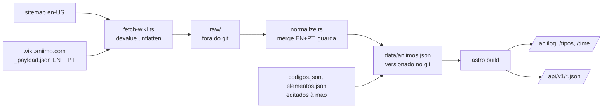

# ADR-001 — aniimo.ogoulart.dev: Hub de ferramentas de Aniimo

22 de set. de 2026 · @agb

## Status

Proposto em 22/09/2026, aguardando aprovação do autor. Este ADR consolida as decisões de produto, arquitetura, dados e risco jurídico do hub de ferramentas fan-made de Aniimo em aniimo.ogoulart.dev.

| Campo | Valor |
|---|---|
| Estado | Proposto (revisado em 22/09/2026, ver [Revisões](#revisões-de-22092026)) |
| Escopo | Site estático de ferramentas para jogadores de Aniimo, em PT-BR, não-comercial |
| Substitui | Nenhum ADR anterior |
| Próxima revisão | 30 dias após o lançamento público do site, ou em qualquer gatilho da seção final |

## Contexto

Aniimo é um ARPG free-to-play de coleção de criaturas da Pawprint Studio (label da FunPlus), lançado em 16/09/2026 no PC, PS5 e Xbox, com lançamento mobile em 23/09/2026. O lançamento foi forte (pico de cerca de 168 mil jogadores simultâneos na Steam), mas as avaliações na Steam estão "Mixed" (~62% positivas), e o jogo tem uma semana de vida. Esses números são voláteis.

O ecossistema de fan-sites já é denso: aniimotools.dev, metabot.gg, aniidex.com, aniimoverse.com, wikily.gg, fextralife e game8 cobrem dex, tabela de tipos, tier list, montador de time, mapa e Homeland. Quase tudo é em inglês; só o aniimotools tem PT-BR. Nenhum deles oferece dados abertos documentados para outros desenvolvedores.

O problema a resolver: não existe um hub de ferramentas de Aniimo em português, com dados abertos, feito para a comunidade brasileira. O lançamento mobile traz uma onda de jogadores novos procurando ajuda básica, então velocidade importa mais do que amplitude.

Mecânicas do jogo que geram dados para ferramentas, conforme a wiki oficial:

- Aniilog (dex) com 6 stats base mais o total: HP, ATK, BREAK, P.DEF, M.DEF, REGEN (em PT: PV, ATQ, QUEBRA, DEF F., DEF M., REGEN.). Na wiki, as chaves internas de BREAK e REGEN são `magicAttack` e `haste`.
- 9 elementos (fire, water, grass, electric, ice, rock, wind, holy, dark) com multiplicadores 1,6× (super-efetivo) e 0,625× (resistido).
- 5 papéis de combate (dps, break, sup, heal, energy). Um Aniimo pode ter mais de um.
- Estágios evolutivos 1 a 4 (1–3 = Lumin → Gamma → Nova, nomes oficiais; o 4 não tem nome), e cada estágio é um id próprio na wiki. O estágio pode variar entre formas do mesmo id.
- Formas regionais e variantes raras (Prismana, Umbral, Sparkling). A forma pode mudar o elemento.
- Cerca de 256 skills, traits, Resonance e a Homeland com 385 receitas.

Em 22/09/2026 a wiki lista **88 ids e 208 formas**. A contagem muda com patches.

## Decisões

O site será estático, em PT-BR, hospedado no subdomínio aniimo.ogoulart.dev, alimentado por um único pipeline de dados JSON versionado, sem backend, sem anúncios e sem hospedar assets oficiais.

| # | Decisão | Escolha | Alternativas rejeitadas | Motivo |
|---|---|---|---|---|
| D1 | Domínio | Subdomínio aniimo.ogoulart.dev | Domínio próprio com "aniimo" no nome | Um domínio com a marca pode ser tomado via UDRP; o subdomínio não. O jogo tem uma semana; a diferença de SEO é pequena. Revisar em 22 de nov. de 2026 |
| D2 | Stack | Astro + TypeScript + Tailwind. Preact entra (`astro add preact`) quando surgir a primeira ilha interativa | Next.js, SPA em React | Site estático gera uma página indexável por Aniimo; JS mínimo no mobile |
| D3 | Hospedagem | Cloudflare Pages | Vercel, VPS | Grátis, deploy por push, HTTPS pronto, CDN global |
| D4 | Dados | JSON versionado no repositório, atualizado por GitHub Action diária | Banco de dados, CMS | Sem infraestrutura; histórico via git; o mesmo JSON vira a API pública |
| D5 | Imagens | Hotlink do CDN oficial com `loading="lazy"` e placeholder | Hospedar dump dos assets | Reduz risco jurídico; assets ficam sob controle da Pawprint |
| D6 | Nomes e textos | Nomes e textos oficiais do locale `/pt` da wiki (pt-PT, conferidos: batem com o cliente em português), com o EN guardado ao lado para busca | Traduzir por conta própria; exibir só EN | Tradução inventada confunde o jogador e quebra a busca |
| D7 | Estado do usuário | localStorage com exportar/importar | Login, backend, banco | Rastreador e montador funcionam sem conta; zero custo e zero dados pessoais |
| D8 | Analytics | Cloudflare Web Analytics | Google Analytics | Sem cookies, dispensa banner de consentimento |
| D9 | Monetização | Nenhuma até decisão explícita | Anúncios, Patreon desde o início | Uso comercial de assets viola os Termos da Pawprint e aumenta o risco de takedown |
| D10 | Posicionamento | Hub PT-BR com dados abertos | Clone em português de um site existente | É o gap real do mercado; a API atrai bots e devs da comunidade |
| D11 | URL | `/aniilog/[slug]` com slug do nome PT sem acentos (`brasim`), congelado por id na primeira atribuição | Slug EN; slug que acompanha o nome, com redirects | URL em português; congelar evita links quebrados se a tradução mudar, sem precisar de redirect |

## Fontes de dados e assets

A fonte de verdade é a wiki oficial; tudo o mais serve para cruzar, referenciar ou acelerar o início.

| Fonte | O que fornece | Formato | Uso e licença |
|---|---|---|---|
| Wiki oficial (wiki.aniimo.com) | Formas, atributos, evoluções, habitats, skills, traits, Resonance | Nuxt 3: `/{rota}/_payload.json`, codificado com devalue. Decodifica com `devalue.unflatten` + revivers do Nuxt (`ShallowReactive`, `Reactive`, `Ref`…) | Fonte primária. robots.txt = `Allow: /`. Conteúdo © Pawprint |
| Sitemap da wiki (`/__sitemap__/en-US.xml`) | Índice de todas as rotas `/item/{id}/{forma}`; a rota PT é a mesma com prefixo `/pt` | XML | Índice do pipeline |
| CDN oficial `worldx-website-cdn.aniimo.com/official-website/worldx/wiki_stage/init/` | Arte full-body, avatares, ícones de skill, trait e item, VFX | PNG e MP4 | Somente hotlink (D5). © Pawprint |
| Wiki no Fandom | Textos e imagens da comunidade | MediaWiki API (`/api.php`) | Reutilizável sob CC BY-SA com atribuição. Pequena e pouco editada |
| dluzgames/aniimo-wiki | `data/all_aniimos.json` (~376 registros) e assets extraídos | JSON, PNG | Referência de esquema. Sem licença declarada; não redistribuir os assets |
| NightmareFTW/NightmareFTW.github.io | `scripts/update-aniimo.js`: scraper dos payloads com cron diário | JS | Referência de arquitetura do pipeline |
| wanghuan072/aniimo | Site Astro com aniimo.json e pipeline documentado | JSON, Astro | Referência de estrutura Astro |
| Eisenrot/aniimo-homeland-optimizer | Otimizador da Homeland | Web | Sem licença declarada: não usar código nem dados |
| ae-bii/aniimax | Receitas, tempos, preços, requisitos e regras de eficiência da Homeland, conferidos no jogo | CSV + JS | **MIT** (© aebii): base do `/homeland/` via `scripts/homeland.ts`, com a licença junto dos dados |
| hideoutgacha, game8 | Otimizador e guias de Homeland | HTML | Termos proíbem copiar e extrair dados: só como referência de produto |
| game8 e aniimotools | Códigos de resgate, tabela de tipos, contagens | HTML | Cruzamento manual dos dados inseridos à mão |

Padrões de URL do CDN:

| Asset | Padrão |
|---|---|
| Arte full-body | `Wiki_Aniimo_{codigo}.png` (ex.: `Wiki_Aniimo_10051.png` = Emberpup/Brasim) |
| Avatar por estágio | `Wiki_PetHead_{codigo}.png` (sufixos 51/52/53/55) |
| Ícone de skill | `{prefixo}_Skill_{skillId}_Icon.png` (única fonte do id da skill) |
| Ícone de trait | `{prefixo}_Feature_{id}_Icon.png` (única fonte do id do trait) |
| Ícone de item | `0_Item_{id}_Icon.png` |

Ícones de Homeland (verificado em 23/09/2026): o CDN oficial **não** tem ícones de itens nem de instalações de Homeland (`0_Item_{id}_Icon.png` dá 404 para os ids de Homeland; só existe o que a wiki usa, como `152100`). O site oficial também não tem. O dluzgames tem os ícones extraídos, mas sem licença, e extraído do cliente contraria o D5. Por isso o `/homeland/` usa ícones próprios (Lucide, ISC) por instalação. Se a Pawprint publicar os ícones no CDN, os ids por nome do dluzgames servem de referência para o hotlink.

Os nomes dos elementos divergem entre fontes (Rock/Earth, Holy/Light, Electric/Lightning). O site usa as chaves da wiki oficial (`holy`, não `light`) e guarda os apelidos como sinônimos para a busca.

## Restrições jurídicas e mitigação

Os Termos de Uso da Pawprint (versão de 17/08/2026) reservam todo o IP e não têm política permissiva para conteúdo fan. O site opera na tolerância prática que a Pawprint demonstra com os fan-sites existentes, não numa licença.

| Cláusula | O que diz | Impacto no site |
|---|---|---|
| 6.3 | Licença só para uso pessoal e não-comercial | Sem anúncios nem venda (D9) |
| 8.1.2 | Proíbe reproduzir, distribuir e criar obras derivadas do conteúdo | Não hospedar nem redistribuir assets (D5); payloads brutos não vão para o git |
| 8.1.11 | Proíbe usar os serviços para construir produto concorrente | Ferramentas complementam o jogo, não o substituem |
| 8.1.14 | Proíbe scraping e data-mining dos serviços | Coleta limitada à wiki pública, que declara `Allow: /`; sem tocar no cliente do jogo |
| 19.2 | Nenhum material pode ser copiado ou raspado sem permissão escrita | Dados factuais (stats, nomes, números) têm proteção fraca; arte tem proteção forte |

Mitigações adotadas:

- Disclaimer em todas as páginas: "Fan-site não-oficial. Aniimo e todos os assets são © Pawprint Studio. Sem afiliação."
- Página de créditos com links para a wiki oficial e para o Fandom (atribuição CC BY-SA).
- Sem anúncios, sem assinatura, sem loja.
- Imagens só por hotlink; o repositório não contém nenhum PNG oficial.
- Nome "aniimo" apenas no subdomínio, em uso nominativo, sem logo oficial no cabeçalho.
- Nenhum código de mod, trainer ou cheat é usado ou referenciado.
- O scraper se identifica no User-Agent (`aniimo.ogoulart.dev data bot (+https://aniimo.ogoulart.dev/creditos)`), usa concorrência 2 com 250 ms entre requests e roda uma vez por dia.

Protocolo em caso de takedown: responder em até 48 horas, remover o que foi pedido, manter o site só com dados factuais e textos próprios, e registrar o pedido no repositório. Contato da Pawprint: support@aniimo.com.

## Escopo das ferramentas

Três fases: a Fase 1 coloca o site no ar em uma semana, a Fase 2 faz o jogador voltar, e a Fase 3 cria o diferencial que nenhum concorrente tem.

| Fase | Ferramenta | Rota | Dados | Esforço |
|---|---|---|---|---|
| 1 | Aniilog PT-BR: busca e filtros por elemento, papel e estágio; página por Aniimo com stats, skills, traits, evoluções, formas e onde encontrar | `/aniilog`, `/aniilog/[slug]` | aniimos.json | Médio |
| 1 | Tabela de tipos interativa | `/tipos` | elementos.json (81 confrontos, conferidos à mão) | Baixo |
| 1 | Códigos de resgate com botão de copiar e status ativo/expirado | `/codigos` | codigos.json (manual) | Muito baixo |
| 2 | Rastreador de coleção, incluindo Prismana; exporta e importa | `/colecao` | aniimos.json + localStorage | Baixo |
| 2 | Montador de time: cobertura de elementos, fraquezas em comum e equilíbrio de papéis | `/time` | aniimos.json, elementos.json | Médio |
| 2 | Planejador de Resonance (evolução sem dados oficiais) | `/evolucao` | resonance.json (manual, conferido pela Action contra a wiki) | Médio |
| 3 | API JSON pública com página de documentação e atribuição | `/api/v1/*.json` | Os mesmos JSONs, publicados como estáticos | Baixo |
| 3 | Bot de Discord PT-BR (`/aniimo <nome>`) consumindo a API | Worker `aniimo-bot` (HTTP interactions) | API | Médio |
| 3 | Comparador de stats entre formas e builds | `/comparar` | aniimos.json | Médio |

Fora do escopo, e por quê:

- Mapa interativo: o aniidex já tem mais de 4 mil pontos; custo alto, ganho baixo.
- Otimizador da Homeland: o repositório do Eisenrot já resolve.
- Calculadora de dano: nenhuma fonte tem a fórmula verificada; publicar uma fórmula chutada queimaria a credibilidade do site. Entra só quando a comunidade tiver dados testados.
- Login, contas e qualquer dado pessoal (D7).
- Mods, trainers e cheats (viola os Termos).

## Modelo de dados e repositório

Um pipeline único alimenta todas as ferramentas: a Action lê o sitemap, baixa os payloads EN e PT de cada forma, decodifica, normaliza e grava JSON no repositório; o build do Astro lê esses JSONs e gera as páginas e a API.



A Action roda uma vez por dia (09:00 UTC) e só faz commit quando `data/` mudou, o que dispara o deploy. Para isso:

- o `normalize.ts` descarta campos voláteis (`viewCount`);
- `coletadoEm` só avança quando o registro muda;
- a guarda aborta sem escrever se as formas caírem mais de 10%, se algum id sumir, se faltar nome ou slug, se aparecer elemento ou papel desconhecido ou se algum stat não for numérico.

Esquema (fonte da verdade: `src/types.ts`). Um registro por id, com as formas completas:

```ts
type Aniimo = {
  id: string;            // "001"
  slug: string;          // "brasim" — do nome PT, congelado (D11)
  nome: { pt: string; en: string };
  desc: { pt: string; en: string };
  evoluiPara: string[];  // slugs
  formas: Forma[];
  coletadoEm: string;    // ISO 8601
};

type Forma = {
  chave: string;         // "basic-form", "highland-form"
  nome: { pt: string; en: string };
  estagio: number;       // 1–4
  elementos: Elemento[]; // "fire" | "water" | "grass" | "electric" | "ice" | "rock" | "wind" | "holy" | "dark"
  papeis: Papel[];       // "dps" | "break" | "sup" | "heal" | "energy"
  stats: { hp; atk; brk; pdef; mdef; regen; total }; // nomes exibidos no jogo
  skills: Habilidade[];  // inline: { id, nome, desc, icone, grupo, poder?, custo? }
  traits: Habilidade[];
  locais: { pt: string; en: string }[]; // seção Habitats; pode ser vazio
  imagem: string;        // URL do CDN oficial
};
```

Skills e traits ficam inline em cada forma. `skills.json`/`traits.json` deduplicados saem do próprio `aniimos.json` quando alguma ferramenta precisar, sem novo scraping.

Estrutura do repositório:

```
aniimo/
├── docs/adr/                # este ADR
├── scripts/
│   ├── fetch-wiki.ts        # sitemap → payloads EN+PT → raw/
│   └── normalize.ts         # raw/ → data/aniimos.json, com guarda
├── raw/                     # cache local, no .gitignore
├── data/
│   ├── aniimos.json
│   ├── elementos.json       # manual, conferido (Fase 1)
│   └── codigos.json         # manual (Fase 1)
├── src/
│   ├── types.ts
│   ├── layouts/Base.astro   # disclaimer em todas as páginas
│   └── pages/
└── .github/workflows/
    └── update-data.yml      # cron diário
```

## Cronograma e primeiros passos

Meta: Fase 1 no ar até 30 de set. de 2026, uma semana após o lançamento mobile.

| Período | Entrega |
|---|---|
| 22–23/09 | Validação das fontes, repositório criado, site "em breve" no ar com HTTPS e disclaimer |
| 24–26/09 | Pipeline de dados rodando na Action; /aniilog e /aniilog/[slug] |
| 27–28/09 | /tipos, /codigos, revisão mobile, divulgação |
| 29/09–05/10 | Rastreador de coleção e montador de time |
| 06–12/10 | Planejador de evolução e API pública com documentação |
| 13/10 em diante | Bot de Discord, comparador de stats, backlog vindo do feedback |
| 22 de nov. de 2026 | Revisão de domínio próprio com base no tráfego |

Primeiros passos, em ordem:

- [x] Validar os payloads da wiki (buildId `5ae23614-…`, `/item/001/basic-form/_payload.json`, locale `/pt`)
- [x] Validar o hotlink de `Wiki_Aniimo_10051.png` no CDN (200 sem referer)
- [x] Criar o projeto Astro + Tailwind
- [x] Criar o repositório público [goul4rt/aniimo-tools](https://github.com/goul4rt/aniimo-tools) e fazer o push
- [x] Conectar à Cloudflare Pages (projeto `aniimo-tools`, deploy por push em `main`, no ar em aniimo-tools.pages.dev)
- [x] Servir https://aniimo.ogoulart.dev. O token do wrangler não tem escopo de DNS, então um Worker (`proxy/`) com custom domain repassa para o Pages. Trocar por custom domain direto no Pages quando existir o CNAME
- [x] Escrever `fetch-wiki.ts`
- [x] Escrever `normalize.ts` e gerar `aniimos.json`
- [x] Configurar `update-data.yml` com cron diário e commit só quando houver mudança
- [x] Confirmar a primeira execução da Action (22/09: 416 payloads, sem bloqueio do ESA, "sem mudanças")
- [x] Construir /aniilog e /aniilog/[slug]
- [x] Montar `elementos.json` e construir /tipos. A wiki oficial não publica a tabela: matriz da comunidade cruzada em 3 fontes, com 6 divergências exibidas na página. Falta conferir no jogo
- [x] Construir /codigos a partir de `codigos.json` (2 fontes; recompensa só quando concordam)
- [x] Fase 2 (parcial): /colecao (localStorage + exportar/importar) e /time (4 slots, time salvo na URL para compartilhar)
- [x] Fase 3 (parcial): API estática em /api/v1 com CORS e documentação em /api
- [x] Planejador de Resonance (/evolucao). A wiki só publica os estágios 6–7 (nível 55/65, 1×/2× Cristal de Onifonte), iguais nas 208 formas; o `normalize.ts` confere isso todo dia contra `data/resonance.json`. Estágios 1–5, estrelas e créditos vêm da comunidade (2 fontes; créditos de 1). Requisitos de evolução não existem na wiki (condições vazias) e ficaram de fora
- [x] Comparador de stats (/comparar, até 3, salvo na URL)
- [x] Bot de Discord (`bot/`): Worker de HTTP interactions, sem servidor, `/aniimo <nome>` com autocomplete, consumindo a API. No ar em aniimo-bot.extremeplays4.workers.dev
- [x] Ativar o bot: segredo no Worker, endpoint aceito pelo Discord (PING verificado) e `/aniimo` registrado
- [ ] Divulgar nos canais em português do Discord oficial, em comunidades BR no Reddit e em grupos de Telegram/WhatsApp; pedir relatos de erro nos dados

## Consequências, riscos e gatilhos de revisão

O que ganhamos: custo zero de infraestrutura, um site rápido e indexável, uma única base de dados que barateia cada ferramenta nova, e exposição jurídica mínima. O que aceitamos: nada de recursos que exijam conta ou dados no servidor, dependência do formato interno da wiki oficial (que pode mudar sem aviso), e uma marca menos memorável enquanto ficar no subdomínio.

| Risco | Probabilidade | Mitigação |
|---|---|---|
| A wiki oficial muda o formato dos payloads e quebra o pipeline | Alta ao longo dos meses | A guarda do `normalize.ts` aborta sem sobrescrever; o site continua com os dados anteriores; o GitHub avisa por e-mail |
| O CDN da wiki (ESA) bloqueia os runners do GitHub | Baixa (primeira execução passou em 22/09) | Descobrir na primeira execução; alternativas: outro horário, rodar localmente |
| Takedown ou pedido da Pawprint | Baixa, maior se monetizar | Protocolo de 48 horas; site sobrevive só com dados factuais |
| O jogo esfria e a comunidade some | Média | Investimento pequeno e incremental; a base de código serve para outro jogo de criaturas |
| Dados errados publicados | Média | Wiki oficial como fonte única; `coletadoEm` em cada registro; canal de relato de erro |
| A tradução pt-PT de um nome muda | Média | Slug congelado (D11); só o nome exibido muda |
| CDN oficial bloqueia hotlink por referer | Baixa | Placeholder automático; sem imagens o site ainda funciona |
| Concorrentes em EN lançam PT-BR | Média | Diferencial fica na API aberta e na comunidade BR, não só no idioma |

Este ADR deve ser revisado quando qualquer um destes acontecer:

- A Pawprint publicar uma API oficial ou uma política de conteúdo fan (migrar para ela, rever D4 e D5).
- Um pedido de takedown chegar (rever D5 e D6).
- O site atingir tráfego consistente por um ou dois meses (rever D1, domínio próprio).
- Surgir a intenção de monetizar (rever D1, D5 e D9; considerar pedir permissão escrita à Pawprint).
- A comunidade validar uma fórmula de dano (rever o escopo da Fase 3).
- Os dados do jogo passarem a exigir contas ou estado no servidor (rever D7).

## Revisões de 22/09/2026

Mudanças em relação ao texto original, decididas depois de inspecionar os payloads reais da wiki:

- **Stats:** os 6 stats do texto original estavam certos. A wiki guarda BREAK e REGEN nas chaves internas `magicAttack` e `haste`, mas os rótulos oficiais (i18n da wiki) são BREAK/QUEBRA e REGEN. O esquema usa os nomes exibidos: `hp, atk, brk, pdef, mdef, regen, total`.
- **Papéis e elementos são arrays** na fonte (`papeis[]`, `elementos[]`). As chaves dos papéis são `dps, break, sup, heal, energy`, e a do elemento é `holy`, não `light`.
- **Estágio:** é um número de 1 a 4 e fica por forma, porque varia entre formas (ex.: 10003). 1–3 = Lumin/Gamma/Nova segundo a i18n oficial.
- **Rótulos PT oficiais** (elementos, papéis, stats, estágios) vêm do i18n da wiki (`/_i18n/{hash}/pt/messages.json`) e ficam em `src/rotulos.ts`.
- **Nomes PT oficiais** existem no locale `/pt` (D6). O pipeline coleta EN e PT e faz o merge por id.
- **Slug PT congelado por id** (nova D11).
- **Um registro por id com `formas[]` completas**, sem diff contra a forma base.
- **Skills e traits inline**; sem `skills.json`/`traits.json` até alguma ferramenta precisar. O id vem do nome do ícone. Habilidades de travessia (CLIMB/GLIDE, sem ícone) ficam fora por enquanto.
- **`locais` vêm da seção `Habitats`** (EN+PT), presente em 160 das 208 formas; vazio quando a página não tem.
- **Sem Resonance** no esquema por ora: é uma tabela HTML e vai precisar de parser na Fase 2.
- **`raw/` fora do git:** evita cerca de 5 MB de ruído diário (`viewCount`) e a redistribuição integral das páginas.
- **Índice pelo sitemap**, não por navegação entre páginas.
- **Preact adiado** até a primeira ilha (D2).
